# Fluxo Detalhado e Pseudocódigo - Captura M3U8

## 📊 Diagramas de Fluxo

### 1. Fluxo Geral - Decisão M3U8 vs Screen Capture

```mermaid
flowchart TD
    Start([Cliente solicita /hls/channel/stream.m3u8]) --> LoadChannel[Carregar definição do canal]
    LoadChannel --> CheckFlag{channel.useM3u8Link?}
    
    CheckFlag -->|true| M3U8Flow[Fluxo M3U8]
    CheckFlag -->|false| ScreenFlow[Fluxo Screen Capture<br/>EXISTENTE]
    
    M3U8Flow --> CreateTempPage[Criar página temporária<br/>SEM captura de tela]
    CreateTempPage --> EnableCDP[Habilitar CDP Network.enable]
    EnableCDP --> Navigate[Navegar para URL]
    Navigate --> WaitLogin{Profile requer<br/>waitForNetworkIdle?}
    
    WaitLogin -->|sim| WaitIdle[Aguardar network idle<br/>usuário pode fazer login]
    WaitLogin -->|não| MonitorNetwork[Monitorar tráfego de rede]
    WaitIdle --> MonitorNetwork
    
    MonitorNetwork --> CheckM3U8{M3U8 detectado<br/>em 15s?}
    
    CheckM3U8 -->|sim| CapturedM3U8[M3U8 URL capturada]
    CheckM3U8 -->|não| Error503[Retornar HTTP 503<br/>No M3U8 detected]
    
    CapturedM3U8 --> CloseTempPage[Fechar página temporária]
    CloseTempPage --> ValidateM3U8{Validar URL<br/>acessível?}
    
    ValidateM3U8 -->|sim| SpawnFFmpeg[FFmpeg: -i m3u8_url]
    ValidateM3U8 -->|não| Error500[Retornar HTTP 500<br/>M3U8 not accessible]
    
    SpawnFFmpeg --> Segment[fMP4Segmenter processa<br/>stdout do FFmpeg]
    Segment --> ReturnPlaylist[Retornar playlist.m3u8]
    ReturnPlaylist --> Success([Cliente recebe stream])
    
    ScreenFlow --> ExistingFlow[Fluxo atual mantido:<br/>puppeteer-stream + FFmpeg]
    ExistingFlow --> Success
    
    Error503 --> ClientError([Cliente vê erro])
    Error500 --> ClientError
    
    style M3U8Flow fill:#e1f5ff
    style Error503 fill:#ffebee
    style Error500 fill:#ffebee
    style Success fill:#e8f5e9
```



### 2. Fluxo Detalhado - captureM3u8FromNetwork()

```mermaid
sequenceDiagram
    participant S as setupStream()
    participant C as captureM3u8FromNetwork()
    participant B as Browser Page
    participant CDP as Chrome DevTools Protocol
    participant N as Network Traffic
    
    S->>B: Criar página temporária
    S->>C: Chamar captura
    C->>CDP: createCDPSession()
    CDP-->>C: CDP Session
    
    C->>CDP: Network.enable
    Note over C,CDP: Habilitar monitoramento de rede
    
    C->>CDP: Listener: Network.responseReceived
    Note over C,CDP: Escutar todas respostas HTTP
    
    C->>B: navigateToPage(url, profile)
    
    alt Profile.waitForNetworkIdle = true
        B->>N: Navegar + esperar idle
        Note over B,N: Usuário pode fazer login
    else Profile.waitForNetworkIdle = false
        B->>N: Navegar imediatamente
    end
    
    loop Monitor por 15s
        N-->>CDP: Network.responseReceived event
        CDP-->>C: responseUrl
        C->>C: isM3u8Url(responseUrl)?
        
        alt URL matches .m3u8 pattern
            C->>C: capturedM3u8 = responseUrl
            C->>C: BREAK loop
        end
    end
    
    alt M3U8 capturado
        C-->>S: { success: true, m3u8Url }
        S->>B: Fechar página
        S->>S: setupM3u8Stream()
    else Timeout (15s)
        C-->>S: { success: false, reason }
        S->>B: Fechar página
        S-->>S: throw StreamSetupError(503)
    end
```



### 3. Fluxo - setupM3u8Stream() com FFmpeg

```mermaid
flowchart TD
    Start([setupM3u8Stream chamado]) --> ValidateURL{M3U8 URL<br/>válida?}
    
    ValidateURL -->|não| ErrorInvalid[throw StreamSetupError<br/>500: Invalid M3U8]
    ValidateURL -->|sim| SpawnFFmpeg[Spawn FFmpeg processo]
    
    SpawnFFmpeg --> FFmpegArgs["Args:<br/>-i m3u8_url<br/>-c:v copy<br/>-c:a aac<br/>-f mp4<br/>-movflags frag_keyframe"]
    
    FFmpegArgs --> StdoutPipe[stdout → captureStream]
    StdoutPipe --> Segmenter[fMP4Segmenter]
    
    Segmenter --> ParseBoxes[Parse MP4 boxes:<br/>ftyp, moov, moof, mdat]
    ParseBoxes --> GenInit[Gerar init.mp4]
    GenInit --> GenSegments[Gerar segment0.m4s<br/>segment1.m4s...]
    
    GenSegments --> UpdatePlaylist[Atualizar playlist.m3u8]
    UpdatePlaylist --> RegisterStream[Registrar stream<br/>no registry]
    
    RegisterStream --> MonitorFFmpeg{FFmpeg rodando?}
    
    MonitorFFmpeg -->|erro| ErrorFFmpeg[onCircuitBreak()<br/>Terminar stream]
    MonitorFFmpeg -->|ok| ClientRequest[Cliente baixa segments]
    
    ClientRequest --> Success([Stream ativo])
    
    ErrorInvalid --> ClientError([Erro para cliente])
    ErrorFFmpeg --> ClientError
    
    style Success fill:#e8f5e9
    style ErrorInvalid fill:#ffebee
    style ErrorFFmpeg fill:#ffebee
```

---

## 🔧 Pseudocódigo Detalhado

### 1. setupStream() - Modificado

```typescript
async function setupStream(options: StreamSetupOptions, onCircuitBreak: () => void): Promise<StreamSetupResult> {
  
  // ==================== INÍCIO - EXTRAÇÃO DE OPÇÕES ====================
  
  const {
    channel,
    channelName,
    channelSelector,
    clickSelector,
    clickToPlay,
    noVideo,
    onTabReplacementFactory,
    profileOverride,
    url,
    useM3u8Link  // NOVA opção
  } = options;

  // Gerar IDs
  const streamId = generateStreamId(channelName, url);
  const numericStreamId = getNextStreamId();
  const startTime = new Date();

  // Registrar AbortController
  const abortController = new AbortController();
  registerAbortController(streamId, abortController);

  // ==================== RESOLUÇÃO DE PERFIL ====================
  
  let profileResult = channel 
    ? getProfileForChannel(channel) 
    : getProfileForUrl(url);

  let profile = profileResult.profile;
  let profileName = profileResult.profileName;

  // Aplicar override de perfil se especificado
  if (profileOverride && isValidProfile(profileOverride)) {
    profile = resolveProfile(profileOverride);
    profileName = profileOverride;
  }

  // Aplicar overrides de opções ad-hoc
  if (noVideo) {
    profile = { ...profile, noVideo: true };
  }
  if (channelSelector) {
    profile = { ...profile, channelSelector };
  }
  if (clickToPlay || clickSelector) {
    profile = { ...profile, clickToPlay: true, clickSelector };
  }

  // ==================== VALIDAÇÕES ====================
  
  // Validar URL
  const validation = validateStreamUrl(url);
  if (!validation.valid) {
    throw new StreamSetupError(
      `Invalid URL: ${validation.reason}`,
      400,
      validation.reason ?? "Invalid URL."
    );
  }

  // Verificar limite de streams concorrentes
  if (getStreamCount() >= CONFIG.streaming.maxConcurrentStreams) {
    throw new StreamSetupError(
      "Concurrent stream limit reached.",
      503,
      `Maximum concurrent streams (${CONFIG.streaming.maxConcurrentStreams}) reached.`
    );
  }

  // ==================== DECISÃO: M3U8 vs SCREEN CAPTURE ====================
  
  const shouldCaptureM3u8 = useM3u8Link ?? channel?.useM3u8Link ?? false;

  if (shouldCaptureM3u8) {
    
    LOG.info("M3U8 capture mode enabled for %s", url);

    // ========== SUB-FLUXO: CAPTURA M3U8 ==========
    
    const browser = await getCurrentBrowser();
    const tempPage = await browser.newPage();
    registerManagedPage(tempPage);

    let m3u8Result: M3u8CaptureResult;

    try {
      
      // ETAPA 1: Capturar M3U8 do tráfego de rede
      m3u8Result = await captureM3u8FromNetwork(tempPage, url, profile);

      if (!m3u8Result.success) {
        // Falha na captura
        throw new StreamSetupError(
          `M3U8 capture failed: ${m3u8Result.reason}`,
          503,
          `Could not capture M3U8 link from ${extractDomain(url)}. ${m3u8Result.reason ?? ''}`
        );
      }

      LOG.info("M3U8 link captured successfully: %s", m3u8Result.m3u8Url);

    } finally {
      // SEMPRE fechar página temporária
      unregisterManagedPage(tempPage);
      if (!tempPage.isClosed()) {
        await tempPage.close().catch(() => {});
      }
    }

    // ETAPA 2: Setup stream usando M3U8
    const metadataComment = channel?.name ?? channelName ?? extractDomain(url);
    const providerName = getProviderDisplayName(url);

    return setupM3u8Stream({
      m3u8Url: m3u8Result.m3u8Url!,
      channelName: channel?.name ?? null,
      metadataComment,
      numericStreamId,
      onCircuitBreak,
      profile,
      profileName,
      providerName,
      startTime,
      streamId,
      url
    });
  }

  // ==================== FLUXO NORMAL: SCREEN CAPTURE ====================
  
  // Código existente permanece inalterado
  const metadataComment = channel?.name ?? channelName ?? extractDomain(url);
  const providerName = getProviderDisplayName(url);

  const onTabReplacement = onTabReplacementFactory 
    ? onTabReplacementFactory(numericStreamId, streamId, profile, metadataComment) 
    : undefined;

  // Criar página com captura
  let captureResult: CreatePageWithCaptureResult;

  try {
    captureResult = await createPageWithCapture({
      comment: metadataComment,
      onFFmpegError: onCircuitBreak,
      profile,
      streamId,
      url
    });
  } catch (error) {
    // Tratamento de erro existente
    const errorMessage = formatError(error);
    const isCaptureError = /* ... lógica existente ... */;
    
    throw new StreamSetupError(
      "Stream error.", 
      isCaptureError ? 503 : 500, 
      "Failed to start stream."
    );
  }

  const { captureStream, context, ffmpegProcess, page, rawCaptureStream } = captureResult;

  // Monitor e cleanup (código existente)
  const monitorStreamInfo: MonitorStreamInfo = { /* ... */ };
  const stopMonitor = monitorPlaybackHealth(/* ... */);

  let cleanupCompleted = false;
  const cleanup = async (): Promise<void> => {
    if (cleanupCompleted) return;
    cleanupCompleted = true;

    stopMonitor();
    if (!rawCaptureStream.destroyed) {
      rawCaptureStream.destroy();
    }
    if (ffmpegProcess) {
      ffmpegProcess.kill();
    }
    unregisterManagedPage(page);
    if (!page.isClosed()) {
      page.close().catch(() => {});
    }
    await minimizeBrowserWindow();
  };

  return {
    captureStream,
    channelName: channel?.name ?? null,
    cleanup,
    ffmpegProcess,
    numericStreamId,
    page,
    profile,
    profileName,
    providerName,
    rawCaptureStream,
    startTime,
    stopMonitor,
    streamId,
    url
  };
}
```

---

### 2. captureM3u8FromNetwork() - Nova Função

```typescript
async function captureM3u8FromNetwork(
  page: Page,
  url: string,
  profile: ResolvedSiteProfile
): Promise<M3u8CaptureResult> {

  let cdpSession: CDPSession | null = null;
  let capturedM3u8: string | null = null;

  try {
    
    // ========== ETAPA 1: CRIAR CDP SESSION ==========
    
    cdpSession = await page.createCDPSession();
    await cdpSession.send("Network.enable");

    LOG.info("Network monitoring enabled for M3U8 capture");

    // ========== ETAPA 2: LISTENER PARA RESPONSES ==========
    
    cdpSession.on("Network.responseReceived", (params: any) => {
      
      const responseUrl = params.response?.url;
      
      // Verificar se é um M3U8
      if (responseUrl && isM3u8Url(responseUrl) && !capturedM3u8) {
        
        // Primeira URL M3U8 encontrada
        LOG.info("M3U8 link detected: %s", responseUrl);
        capturedM3u8 = responseUrl;
      }
    });

    // ========== ETAPA 3: NAVEGAR PARA A PÁGINA ==========
    
    // Usa a função existente que respeita profile.waitForNetworkIdle
    // Se true, aguarda network idle (permite login manual)
    // Se false, retorna após load event
    await navigateToPage(page, url, profile);

    LOG.info("Page loaded, monitoring network for M3U8...");

    // ========== ETAPA 4: AGUARDAR M3U8 (COM TIMEOUT) ==========
    
    const startTime = Date.now();
    const timeout = CONFIG.m3u8?.captureTimeout ?? 15000; // 15 segundos default

    while (!capturedM3u8 && (Date.now() - startTime) < timeout) {
      
      // Poll a cada 500ms
      await delay(500);
      
      // Loop continua até:
      // 1. M3U8 ser capturado (capturedM3u8 !== null)
      // 2. Timeout expirar
    }

    // ========== ETAPA 5: VERIFICAR RESULTADO ==========
    
    if (!capturedM3u8) {
      
      LOG.warn("M3U8 capture timeout (%dms) for %s", timeout, url);
      
      return {
        success: false,
        reason: "No M3U8 link detected in network traffic within timeout period."
      };
    }

    // ========== ETAPA 6: VALIDAR M3U8 (OPCIONAL) ==========
    
    if (CONFIG.m3u8?.validateUrls ?? true) {
      
      const isValid = await validateM3u8Url(capturedM3u8);
      
      if (!isValid) {
        
        LOG.warn("Captured M3U8 URL is not accessible: %s", capturedM3u8);
        
        return {
          success: false,
          reason: "Captured M3U8 URL is not accessible (validation failed)."
        };
      }
    }

    // ========== ETAPA 7: SUCESSO ==========
    
    LOG.info("M3U8 captured and validated: %s", capturedM3u8);

    return {
      success: true,
      m3u8Url: capturedM3u8
    };

  } catch (error) {
    
    // ========== TRATAMENTO DE ERROS ==========
    
    const errorMessage = formatError(error);
    LOG.error("M3U8 capture error: %s", errorMessage);

    return {
      success: false,
      reason: `M3U8 capture error: ${errorMessage}`
    };

  } finally {
    
    // ========== CLEANUP CDP SESSION ==========
    
    if (cdpSession) {
      try {
        await cdpSession.detach();
      } catch {
        // Ignorar erros de detach
      }
    }
  }
}
```

---

### 3. setupM3u8Stream() - Nova Função

```typescript
async function setupM3u8Stream(options: M3u8StreamSetupOptions): Promise<StreamSetupResult> {

  const {
    m3u8Url,
    channelName,
    metadataComment,
    numericStreamId,
    onCircuitBreak,
    profile,
    profileName,
    providerName,
    startTime,
    streamId,
    url
  } = options;

  // ========== ETAPA 1: PREPARAR ARGS DO FFMPEG ==========

  const ffmpegArgs = [
    
    // Input
    "-i", m3u8Url,

    // Codec video: COPY (sem transcodificação)
    "-c:v", "copy",

    // Codec audio: AAC (pode transcodificar de outros formatos)
    "-c:a", "aac",
    "-b:a", String(CONFIG.streaming.audioBitsPerSecond),

    // Output format: MP4 com fragmentação
    "-f", "mp4",
    "-movflags", "frag_keyframe+empty_moov+default_base_moof",

    // Output para stdout
    "-"
  ];

  // Adicionar metadata se disponível
  if (metadataComment) {
    ffmpegArgs.unshift("-metadata", `comment=${metadataComment}`);
  }

  // ========== ETAPA 2: SPAWN FFMPEG ==========

  const ffmpegProcess = spawn("ffmpeg", ffmpegArgs, {
    stdio: ["ignore", "pipe", "pipe"]
    //       stdin    stdout stderr
  });

  // ========== ETAPA 3: HANDLERS DE ERRO ==========

  ffmpegProcess.on("error", (error) => {
    
    LOG.error("FFmpeg M3U8 process error: %s", formatError(error));
    
    // Disparar circuit breaker
    onCircuitBreak();
  });

  // Log stderr para debug
  ffmpegProcess.stderr.on("data", (data) => {
    LOG.debug("FFmpeg M3U8: %s", data.toString().trim());
  });

  // ========== ETAPA 4: STREAM DE SAÍDA ==========

  const captureStream = ffmpegProcess.stdout;

  // captureStream será consumido pelo fMP4Segmenter
  // que gerará init.mp4 + segmentN.m4s

  // ========== ETAPA 5: MONITOR INFO ==========

  const monitorStreamInfo: MonitorStreamInfo = {
    channelName,
    numericStreamId,
    providerName,
    startTime
  };

  // Para M3U8 streams, NÃO fazemos playback health monitoring
  // FFmpeg lida com reconnection e buffering automaticamente
  const stopMonitor = () => ({
    attemptCount: 0,
    circuitBreakerTripped: false,
    lastIssueTime: null,
    lastIssueType: null,
    pageReloadsInWindow: 0
  });

  // ========== ETAPA 6: CLEANUP FUNCTION ==========

  let cleanupCompleted = false;

  const cleanup = async (): Promise<void> => {
    
    if (cleanupCompleted) return;
    cleanupCompleted = true;

    LOG.info("Cleaning up M3U8 stream %s", streamId);

    // Parar monitor (no-op para M3U8)
    stopMonitor();

    // Destruir stream se ainda ativo
    if (!captureStream.destroyed) {
      captureStream.destroy();
    }

    // Matar FFmpeg
    if (!ffmpegProcess.killed) {
      ffmpegProcess.kill("SIGTERM");

      // Aguardar 2s e forçar se necessário
      setTimeout(() => {
        if (!ffmpegProcess.killed) {
          ffmpegProcess.kill("SIGKILL");
        }
      }, 2000);
    }
  };

  // ========== ETAPA 7: RETORNAR RESULTADO ==========

  return {
    
    // Stream para segmenter
    captureStream,
    rawCaptureStream: captureStream, // Mesmo objeto para M3U8

    // Metadata
    channelName,
    numericStreamId,
    streamId,
    url,
    startTime,

    // Profile info
    profile,
    profileName,
    providerName,

    // Processos e funções
    ffmpegProcess,
    stopMonitor,
    cleanup,

    // M3U8 streams não têm browser page
    page: null as any // Hack para compatibilidade com tipo
  };
}
```

---

### 4. isM3u8Url() - Helper Function

```typescript
function isM3u8Url(url: string): boolean {
  
  const M3U8_URL_PATTERNS = [
    
    // Extensão .m3u8 (com ou sem query string)
    /\.m3u8(\?.*)?$/i,

    // Nomes comuns de manifests
    /\/manifest\.m3u8/i,
    /\/playlist\.m3u8/i,
    /\/master\.m3u8/i,

    // Padrão HLS genérico
    /hls.*\.m3u8/i,

    // Variantes com números (segmentos)
    /\/chunklist.*\.m3u8/i,
    /\/media_\d+\.m3u8/i
  ];

  return M3U8_URL_PATTERNS.some((pattern) => pattern.test(url));
}
```

---

### 5. validateM3u8Url() - Validação

```typescript
async function validateM3u8Url(m3u8Url: string): Promise<boolean> {
  
  try {
    
    // HEAD request para verificar se URL é acessível
    const response = await fetch(m3u8Url, {
      method: "HEAD",
      signal: AbortSignal.timeout(5000) // 5s timeout
    });

    // Verificar status HTTP
    if (!response.ok) {
      LOG.warn("M3U8 validation failed: HTTP %d for %s", response.status, m3u8Url);
      return false;
    }

    // Opcionalmente verificar Content-Type
    const contentType = response.headers.get("content-type");
    if (contentType && !contentType.includes("mpegurl") && !contentType.includes("m3u8")) {
      LOG.warn("M3U8 validation warning: unexpected content-type %s", contentType);
      // Não falha, apenas avisa
    }

    return true;

  } catch (error) {
    
    LOG.warn("M3U8 validation error for %s: %s", m3u8Url, formatError(error));
    return false;
  }
}
```

---

## 🎭 Cenários de Uso Detalhados

### Cenário 1: YouTube Live (Sucesso)

```
ENTRADA:
- URL: https://youtube.com/watch?v=abc123
- useM3u8Link: true
- profile: autodetect → keyboardFullscreen

FLUXO:
1. setupStream() detecta useM3u8Link = true
2. Cria página temporária
3. captureM3u8FromNetwork():
   - Navega para youtube.com/watch?v=abc123
   - CDP detecta: https://manifest.googlevideo.com/...index.m3u8
   - Captura após 2s
4. Valida URL (HEAD request) → OK
5. Fecha página temporária
6. setupM3u8Stream():
   - FFmpeg -i https://manifest.googlevideo.com/...index.m3u8
   - stdout → fMP4Segmenter
7. Segmenter gera init.mp4 + segments
8. Cliente recebe playlist.m3u8

SAÍDA:
- HTTP 200 OK
- Stream funcional com baixo uso de CPU
```

### Cenário 2: Site com Login (ESPN+)

```
ENTRADA:
- URL: https://plus.espn.com/live/123
- useM3u8Link: true
- profile: brightcove (waitForNetworkIdle: true)

FLUXO:
1. setupStream() detecta useM3u8Link = true
2. Cria página temporária
3. captureM3u8FromNetwork():
   - Navega para plus.espn.com
   - waitForNetworkIdle = true → aguarda network idle
   - USUÁRIO FAZ LOGIN MANUALMENTE via UI (botão "Login")
   - Após login, player carrega
   - CDP detecta: https://espn-stream.akamaized.net/live.m3u8
4. Valida URL → OK
5. Fecha página
6. setupM3u8Stream() com FFmpeg
7. Stream funcional

SAÍDA:
- HTTP 200 OK
- Stream após login manual
```

### Cenário 3: Site sem M3U8 (Falha)

```
ENTRADA:
- URL: https://example.com/video
- useM3u8Link: true
- profile: default

FLUXO:
1. setupStream() detecta useM3u8Link = true
2. Cria página temporária
3. captureM3u8FromNetwork():
   - Navega para example.com/video
   - Monitora network por 15s
   - NENHUM M3U8 DETECTADO
   - Timeout
4. Retorna { success: false, reason: "No M3U8 detected" }
5. Fecha página
6. throw StreamSetupError(503, "Could not capture M3U8")

SAÍDA:
- HTTP 503 Service Unavailable
- Body: "Could not capture M3U8 link from example.com. No M3U8 link detected..."
- Channels DVR mostra erro ao usuário
```

### Cenário 4: M3U8 Capturado mas Inacessível

```
ENTRADA:
- URL: https://site.com/protected
- useM3u8Link: true

FLUXO:
1. Cria página temporária
2. captureM3u8FromNetwork():
   - Navega
   - CDP detecta: https://cdn.site.com/stream.m3u8?token=expired
3. validateM3u8Url():
   - fetch HEAD https://cdn.site.com/stream.m3u8?token=expired
   - HTTP 403 Forbidden
   - Validação FALHA
4. Retorna { success: false, reason: "M3U8 not accessible" }
5. throw StreamSetupError(500, "Captured M3U8 URL is not accessible")

SAÍDA:
- HTTP 500 Internal Server Error
- Sugestão: pode precisar renovar login
```

---

## 📈 Métricas e Observabilidade

### Logs Importantes

```typescript
// Início da captura M3U8
LOG.info("M3U8 capture mode enabled for %s", url);

// M3U8 detectado
LOG.info("M3U8 link detected: %s", responseUrl);

// Captura bem-sucedida
LOG.info("M3U8 captured and validated: %s", m3u8Url);

// Timeout
LOG.warn("M3U8 capture timeout (%dms) for %s", timeout, url);

// Validação falhou
LOG.warn("Captured M3U8 URL is not accessible: %s", m3u8Url);

// Erro de FFmpeg
LOG.error("FFmpeg M3U8 process error: %s", errorMessage);
```

### Mudanças no Status SSE

Para M3U8 streams, o status deve indicar:

```json
{
  "id": 123,
  "channel": "espn",
  "url": "https://plus.espn.com/live/123",
  "mode": "m3u8",  // NOVO campo
  "health": "healthy",
  "providerName": "ESPN+",
  "startTime": "2026-02-11T10:30:00Z",
  "duration": 45,
  "memoryBytes": 5242880,
  "clientCount": 2
}
```

---

## 🔍 Debugging e Troubleshooting

### Como Testar M3U8 Capture Manualmente

1. **Via DevTools:**
   ```
   - Abrir site no Chrome
   - F12 → Network tab
   - Filtrar: "m3u8"
   - Dar play no vídeo
   - Copiar URL do manifest
   ```

2. **Via código:**
   ```typescript
   // Em src/browser/m3u8Capture.ts, adicionar log extra:
   cdpSession.on("Network.responseReceived", (params) => {
     const url = params.response?.url;
     LOG.debug("Network response: %s", url); // Log TODAS URLs
   });
   ```

3. **Testar FFmpeg manualmente:**
   ```bash
   ffmpeg -i "https://captured.m3u8.url" \
     -c:v copy -c:a aac \
     -f mp4 -movflags frag_keyframe \
     output.mp4
   ```

### Problemas Comuns

| Problema | Causa Possível | Solução |
|----------|----------------|---------|
| Timeout (15s) sem M3U8 | Site não usa HLS | Desativar useM3u8Link |
| M3U8 detectado mas HTTP 403 | Token expirado | Renovar login |
| FFmpeg falha "Invalid data" | M3U8 com DRM | Não suportado, usar screen capture |
| Múltiplos M3U8s detectados | Master + variants | Capturar o primeiro (geralmente master) |
| Site redireciona durante navegação | CDN redirect | Seguir redirect (automático no fetch) |

---

**Versão**: 1.0  
**Data**: Fevereiro 2026
